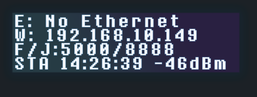

 

  

# Waveshare UGV Robots
This is a Raspberry Pi example for the [Waveshare](https://www.waveshare.com/) UGV robots: **WAVE ROVER**, **UGV Rover**, **UGV Beast**, **RaspRover**, **UGV01**, **UGV02**.  

## Basic Description
The Waveshare UGV robots uses a upper computer and a lower computer.This repo is the program running in the upper computer, Raspberry Pi in this case.  
The program running in lower computer are named [ugv_base_ros](https://github.com/effectsmachine/ugv_base_ros.git) or [ugv_base_general](https://github.com/effectsmachine/ugv_base_general.git), depending on the type of the robot driver you are using.  
The upper computer sends JSON commands to lower computer(the driver of the robots based on ESP32) via GPIO uart. The Host Controller Adopts Raspberry Pi For AI Vision And Strategy Planning, And The Sub Controller Uses ESP32 For Motion Control And Sensor Data Processing, providing efficient collaboration and upgraded performance.

## Features
- Real-time video based on WebRTC
- Interactive tutorial based on JupyterLab
- Pan-tilt camera control
- Robotic arm control
- Cross-platform web application base on Flask
- Auto targeting (OpenCV)
- Object Recognition (OpenCV)
- Gesture Recognition (MediaPipe)
- Face detection (OpenCV & MediaPipe)
- Motion detection (OpenCV)
- Line tracking base on vision (OpenCV)
- Color Recognition (OpenCV)
- Multi-threaded CV processing
- Audio interactive
- Shortcut key control
- Photo taking
- Video Recording

## Tutorial
You need to install Raspberry Pi on your robot if you are using **WAVE ROVER**, **UGV01** or **UGV02**.  

This app is already installed in the SD card of **UGV Rover**, **UGV Beast** and **RaspRover**.  

You can use this tutorial to upgrade your robot's upper computer program.  

You can use this tutorial to install this program on a pure Raspberry Pi OS.  

### Download the repo from github

You can clone this repository from Waveshare's GitHub to your local machine.

    git clone https://github.com/waveshare/ugv_rpi.git
    
Or you can also clone this repository from my GitHub to your local machine.

    git clone https://github.com/effectsmachine/ugv_rpi.git
    
### Grant execution permission to the installation script
    cd ugv_rpi/
    sudo chmod +x setup.sh
    sudo chmod +x autorun.sh
### Install app (it'll take a while before finish)
    sudo ./setup.sh
### Autorun setup
    ./autorun.sh
### AccessPopup installation
    cd AccessPopup
    sudo chmod +x installconfig.sh
    sudo ./installconfig.sh
    *Input 1: Install AccessPopup
    *Press any key to exit
    *Input 9: Exit installconfig.sh
### Reboot Device
    sudo reboot

After powering on the robot, the Raspberry Pi will automatically create a hotspot, and the LED screen will display a series of system initialization messages:  

- The first line `E:` is the IP address of the Ethernet port for remotely accessing the Raspberry Pi. `No Ethernet` means that the Raspberry Pi has no Ethernet cable connection.
- The second line `W:` In AP mode, the robot will automatically establish a hotspot and display the default `IP: 192.168.50.5`. In STA mode, the Raspberry Pi will connect to a known WiFi network and display the IP address for remote access.
- The third line `F/J` Ethernet port number, `5000` is for accessing the robot control Web UI, and `8888` is for accessing the JupyterLab interface.
- The fourth line `STA` means the WIFI is in STA mode, and the time means the usage period of the robot, the value in dBm represents the signal strength RSSI in STA mode.  

You can use a mobile phone or PC to access this robot web app. You can open the browser, and enter `[IP]:5000`(`192.168.10.50:5000` for example) in the URL bar to access and control the robot.
You can use `[IP]:8888`(`192.168.10.50:8888` for example) to access JupyterLab.
If there is not a knowing WiFi for robot to connect, the robot will set up a hotspot automatically. You can use a mobile phone or PC to access this hotspot, the name of the hotspot is AccessPopup, and the password of the hotspot is `1234567890`. After connecting, open the browser, and enter `192.168.50.5:5000` in the URL bar to access and control the robot.

# License
ugv_rpi for the Raspberry Pi: an open source robotics platform for the Raspberry Pi.
Copyright (C) 2024 [Waveshare](https://www.waveshare.com/)

This program is free software: you can redistribute it and/or modify
it under the terms of the GNU General Public License as published by
the Free Software Foundation, either version 3 of the License, or
(at your option) any later version.

This program is distributed in the hope that it will be useful,
but WITHOUT ANY WARRANTY; without even the implied warranty of
MERCHANTABILITY or FITNESS FOR A PARTICULAR PURPOSE.  See the
GNU General Public License for more details.

You should have received a copy of the GNU General Public License
along with this program.  If not, see <http://www.gnu.org/licenses/gpl-3.0.txt>.
